# Module 2 — Analytics Pipeline (`/analytics`)

A single, continuous pipeline over the Titanic dataset: load it **once**, clean it **once**, explore it, then build, evaluate, tune and save a predictive model.

| File | What it does |
|---|---|
| `01_eda.ipynb` | Loads the data (the **only** `sns.load_dataset("titanic")` call), saves `titanic.csv`, profiles, cleans and explores it (Tasks 1–6) |
| `titanic.csv` | Committed offline fallback, written by `df.to_csv("titanic.csv", index=False)` right after loading |
| `titanic_cleaning.py` | The shared cleaning rules used by both notebooks |
| `02_modeling.ipynb` | Reads the same `titanic.csv` and continues into modeling (Tasks 7–15) |
| `titanic_best_pipeline.joblib` | The saved, fitted full pipeline (preprocessing + tuned Random Forest) |
| `predict_demo.py` | Reloads the `.joblib` file and predicts on raw new passengers |
| `figures/` | PNG copies of every chart (supporting artifacts only; every chart is interpreted in text below) |

## How to run

```bash
cd analytics
pip install -r requirements.txt
jupyter nbconvert --to notebook --execute --inplace 01_eda.ipynb       # needs internet once (or uses titanic.csv)
jupyter nbconvert --to notebook --execute --inplace 02_modeling.ipynb  # ~1 minute (GridSearchCV)
python predict_demo.py
```
(Or open them in Jupyter and use *Run All*, in this order.)

**Design choices.**
- **One load, one cleaning.** Only `01_eda.ipynb` calls `sns.load_dataset`, and it saves `titanic.csv` immediately. `02_modeling.ipynb` reads that CSV.
- **Shared cleaning rules.** Both notebooks import the same rules from `titanic_cleaning.py`. These rules never learn a number from the data, so applying them before the split is safe.
- **Leak-free modeling.** Everything learned (imputation, scaling, one-hot categories) happens inside a scikit-learn `Pipeline` fitted on the training split only.
- **Reproducible results.** `random_state=42` is used everywhere, and the library versions are pinned in `requirements.txt`.

---

## Part A — Profiling, cleaning and the data story

### Task 1 — Profile
891 rows × 15 columns. Missing values: `deck` **77.22 %**, `age` **19.87 %**, `embarked` **0.22 %**, `embark_town` **0.22 %**. Target balance: **61.6 % died / 38.4 % survived** (imbalanced).

### Task 2 — Missing values (threshold rule: < 5 % drop rows · 5–30 % impute · > 30 % drop column or own category)

| Column | Measured | Band | Decision |
|---|---|---|---|
| `embarked` | 0.22 % | < 5 % | Drop the 2 rows |
| `embark_town` | 0.22 % | < 5 % | Drop (the same 2 rows) |
| `age` | 19.87 % | 5–30 % | Impute: median age of the same **sex × class** group (EDA); training-set median inside the pipeline (modeling) |
| `deck` | 77.22 % | > 30 % | **Keep, with missing encoded as its own category `"Unknown"`.** Imputing would mean inventing 3 of every 4 values. The gaps are not random: deck was mostly recorded for 1st-class passengers, and passengers with a known deck survived at 66.7 % vs 29.9 % for “Unknown”. That makes missingness a real signal that dropping the column would lose. |

### Task 3 — Univariate (`age`, `fare`)
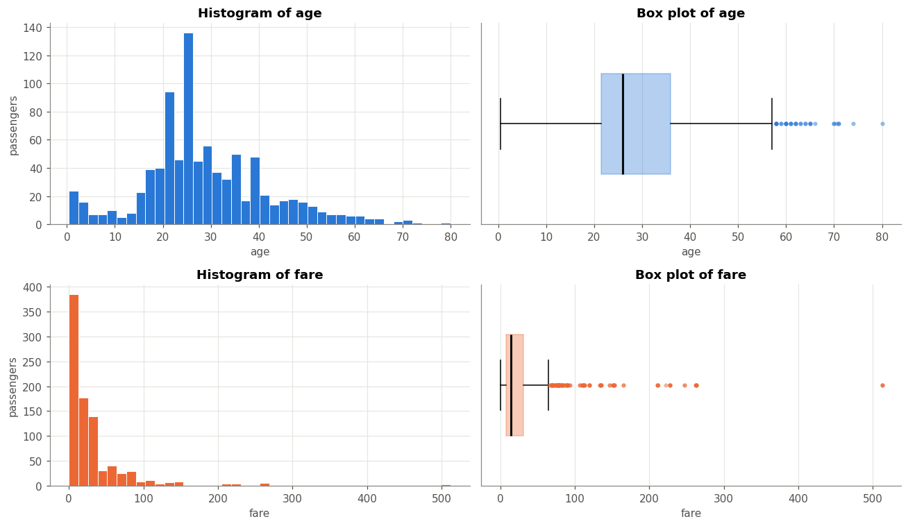

- **IQR outliers.** `age` has **32** outliers on the cleaned data, all above 57.75 years. On the raw known ages alone there are **11**; imputation packs values into the middle, which narrows the IQR. `fare` has **114** outliers (12.8 %), all above £65.66. These are genuine expensive 1st-class tickets, so they were kept.
- **Skewness of `fare`.** mode **£8.05** < median **£14.45** < mean **£32.10**. The mean is pulled far above the median by a long tail of expensive tickets, so **fare is strongly right-skewed** (skewness ≈ 4.8).

### Task 4 — Bivariate
Survival rates from boolean masks (`&` / `|`):

| | Class 1 | Class 2 | Class 3 | All classes |
|---|---|---|---|---|
| **female** | 96.7 % | 92.1 % | 50.0 % | **74.0 %** |
| **male** | 36.9 % | 15.7 % | 13.5 % | **18.9 %** |
| **all** | **62.6 %** | **47.3 %** | **24.2 %** | 38.2 % |

With an OR mask, women **or** children under 16 survived at 71.6 %, compared with 16.4 % for adult men.

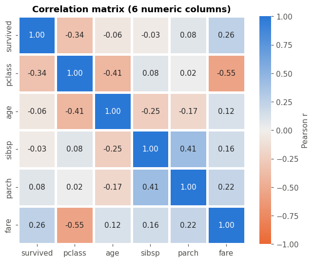

Correlation matrix on exactly `survived, pclass, age, sibsp, parch, fare` (`adult_male` and `alone` excluded). The two strongest off-diagonal pairs by |r|:
1. **`pclass` ↔ `fare` (r = −0.55).** Higher class number (cheaper class) means a lower fare. The two columns partly carry the same “wealth” information.
2. **`sibsp` ↔ `parch` (r = +0.41).** Both measure family travelling together, so large families score high on both.

(`pclass` ↔ `age`, r = −0.41, is a close third: 1st-class passengers were older.)

### Task 5 — Data story: *who survived, and why?*

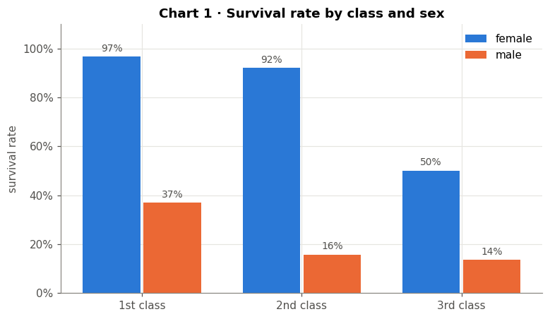
**Chart 1 — Sex first, then class.** In every class, women survived far more often than men: the lifeboat rule of “women and children first” in action. Class then widens the gap. 1st- and 2nd-class women were almost all saved (97 % and 92 %), while 3rd-class women had only a 50 % chance. For men, only 1st class gave a real advantage (37 % vs about 14–16 %).

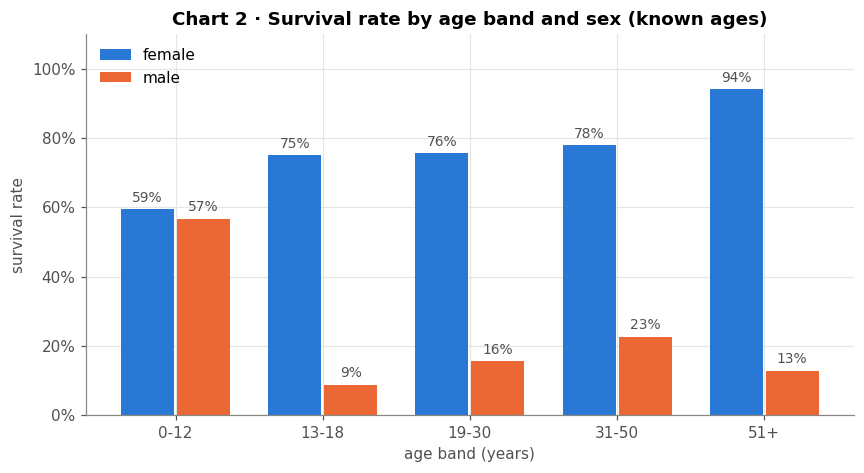
**Chart 2 — Being a child mainly helped boys.** Boys aged 0–12 survived at 57 %, while every older male group survived at only 9–23 %. For females the pattern is reversed. Adult women survived at 75–94 %, but girls aged 0–12 at only 59 %, probably because many young children travelled in large 3rd-class families. So the “children” part of “women and children first” mostly shows up for boys. The chart uses known ages only, so imputed values do not distort it.

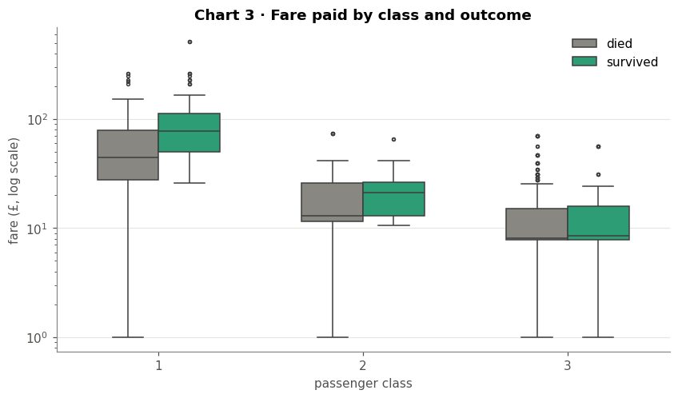
**Chart 3 — Money mattered, especially in 1st class.** Fare separates the classes cleanly (note the log scale). Inside 1st class, survivors paid a median of about £77 vs £45 for those who died; the priciest cabins were closer to the lifeboats. In 3rd class the medians are almost identical (£8.05 vs £8.52), so paying a little more did not help there.

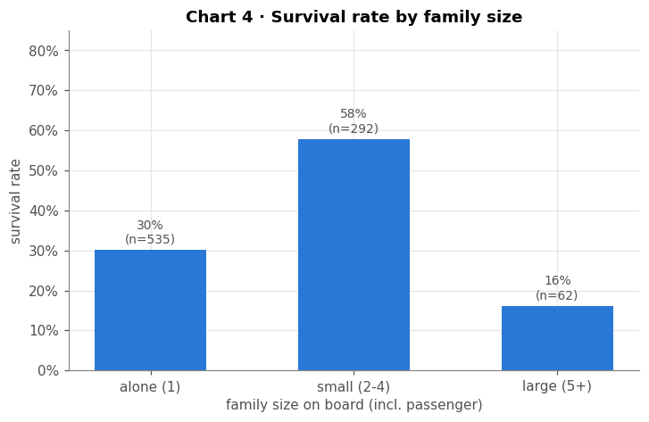
**Chart 4 — Small families did best.** Passengers travelling alone survived at about 30 %, small families (2–4 people) at about 58 %, and large families (5+) at only about 16 %. Lone travellers were mostly adult men in 3rd class. Large families were almost all in 3rd class and struggled to reach the boats together. This non-linear pattern suits tree-based models.

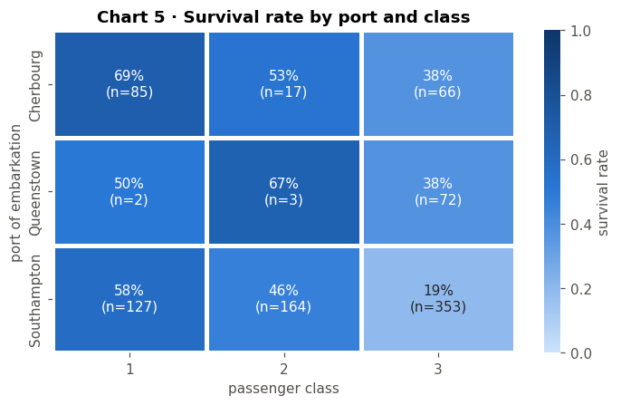
**Chart 5 — Much of the port effect is a class effect.** Cherbourg looks “lucky” (55 % survived vs 34 % from Southampton), but about half of its passengers were 1st class, against only 20 % of Southampton's. Queenstown's passengers were 94 % 3rd class. Comparing within the same class shrinks the gap, though Cherbourg is still ahead (1st class: 69 % vs 58 %; 3rd class: 38 % vs 19 %). A port cannot save anyone by itself, so the remaining gap most likely reflects other differences in who boarded where.

**The story in one paragraph.** Survival followed a clear priority: **women and children first, then wealth**. Sex is the strongest factor (74 % vs 19 %), and class multiplies it: 1st-class women survived at 97 %, 3rd-class men at 14 %. Being a child helped mainly boys, a higher fare helped within 1st class, and small families did better than lone travellers or large families. Port of embarkation matters much less once class is accounted for.

### Task 6 — z-score check (EDA only)
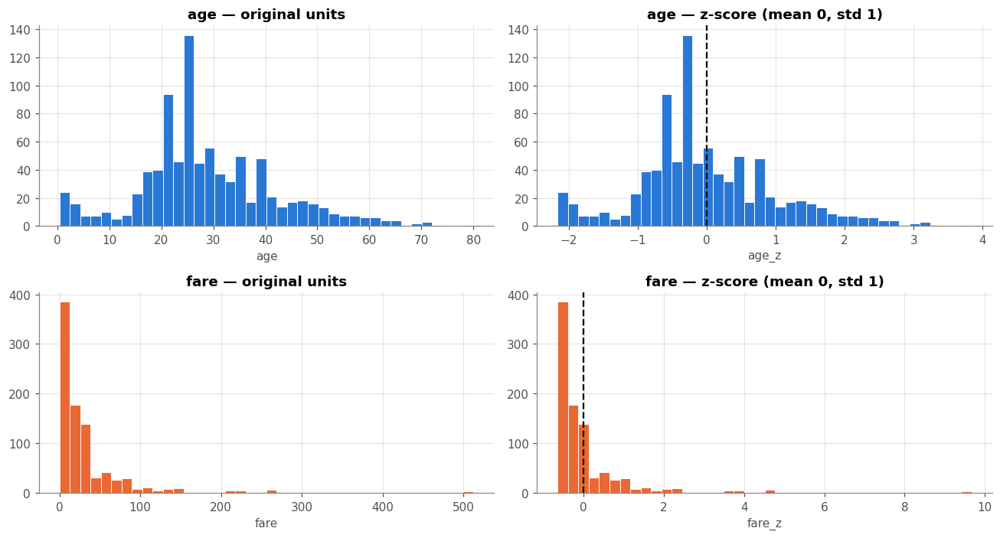

| | mean before | std before | mean after | std after |
|---|---|---|---|---|
| age | 29.07 | 13.26 | 0.0000 | 1.0000 |
| fare | 32.10 | 49.67 | 0.0000 | 1.0000 |

The manual formula `(x − mean) / std` matches `StandardScaler` exactly. Standardizing changes the scale, not the shape: `fare` is still right-skewed. This check does **not** feed the modeling pipeline, which scales using the training split only.

---

## Part B — Predictive modeling

### Task 7 — Stratified split
80/20 split with `stratify=y`, giving **711 train / 178 test**. The survived share is 38.26 % in train and 38.20 % in test. Stratifying matters because the classes are imbalanced (62/38): a random split could put a different share of survivors in the test set, and the score would then partly reflect luck. The split happens before any preprocessing.

### Task 8 — Leak-free preprocessing
A `ColumnTransformer` inside a `Pipeline` handles each column type:
- **Numeric** (`pclass, age, sibsp, parch, fare`): median imputer, then `StandardScaler`.
- **Categorical** (`sex, embarked`): most-frequent imputer, then `OneHotEncoder(handle_unknown="ignore")`.

Every step is fitted on `X_train` only and then only *transforms* `X_test`. The notebook proves this: the scaler's learned fare mean (31.857) equals the **training** mean, not the full-data mean (32.097). Leakage columns (`alive`) and redundant ones (`class`, `who`, `adult_male`, `alone`, `embark_town`) are excluded.

### Tasks 9–10 — Three classifiers, same split
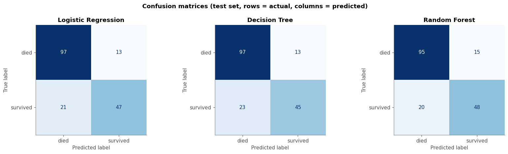
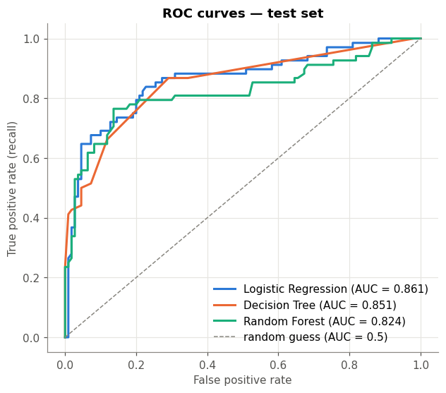
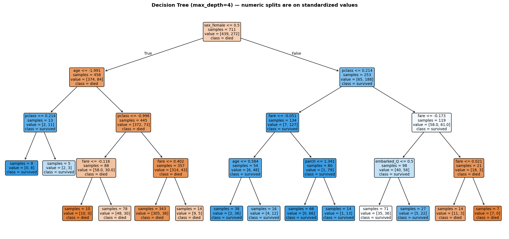

**Reading the tree.** The first split is on sex. Women in 1st/2nd class are predicted to survive. 3rd-class women with higher (family) fares are predicted to die. Among men, only boys of about 3.5 years or younger are predicted to survive.

| Model | Accuracy | Precision | Recall | F1 | AUC | Confusion matrix (TN / FP / FN / TP) |
|---|---|---|---|---|---|---|
| Logistic Regression | 0.809 | 0.783 | 0.691 | 0.734 | **0.861** | 97 / 13 / 21 / 47 |
| Decision Tree (depth 4) | 0.798 | 0.776 | 0.662 | 0.714 | 0.851 | 97 / 13 / 23 / 45 |
| Random Forest (default) | 0.803 | 0.762 | 0.706 | 0.733 | 0.824 | 95 / 15 / 20 / 48 |

- **Logistic Regression** has the best AUC. The main signals are close to linear, so a simple model does well.
- **The Decision Tree** is the easiest to explain but misses the most survivors (lowest recall).
- **The default Random Forest overfits:** 0.985 training accuracy vs 0.803 test accuracy.

All three models find about 70 % of the real survivors. Their most common mistake is missing a survivor (a false negative).

### Task 11 — Imbalance handling (Logistic Regression)
Class balance: 549 died (61.8 %) / 340 survived (38.2 %).

| Variant | Precision | Recall | F1 |
|---|---|---|---|
| (a) Baseline | **0.783** | 0.691 | 0.734 |
| (b) `class_weight='balanced'` | 0.718 | **0.750** | 0.734 |
| (c) SMOTE (training fold only) | 0.735 | 0.735 | **0.735** |

Both balancing methods trade precision for recall, as they are designed to. `class_weight='balanced'` found the most survivors (recall 0.750, 4 more of the 68) at the biggest cost to precision. **SMOTE worked best overall, narrowly.** It gave the most balanced precision/recall and the top F1 (0.735) and AUC (0.867). The F1 differences are tiny because the imbalance is mild (62/38). If missing a survivor is the costlier error, `class_weight='balanced'` is the simpler, recall-focused choice. SMOTE sits inside an `imblearn` Pipeline, so it resampled only the training data (272 → 439 survivors); the test set was never resampled.

### Task 12 — GridSearchCV + OOB
The grid covered `n_estimators` {100, 300, 500} × `max_depth` {None, 4, 6, 8} × `max_features` {sqrt, log2, None}, scored by 5-fold stratified CV on F1, with `RandomForestClassifier(oob_score=True, ...)`.
- **Best parameters:** `n_estimators=300, max_depth=8, max_features=None`. Best CV F1: **0.772**.
- **OOB score: 0.831.** This is close to the tuned model's test accuracy (0.826), so the OOB estimate was reliable.

Limiting the depth fixed the overfitting. Test F1 rose from 0.733 to 0.756, and precision from 0.762 to 0.814.

### Task 13 — Regression side-task (predict `fare`)
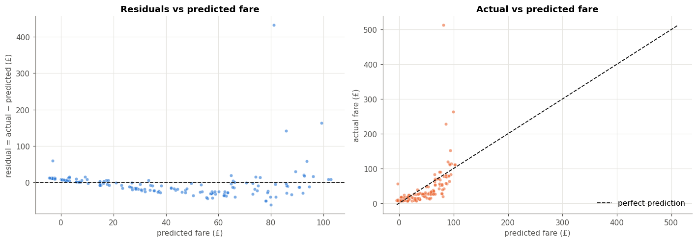

**MAE £19.75 · RMSE £41.27 · R² 0.347 · Adjusted R² 0.308** (n = 178 test rows, p = 10 encoded features). The model explains about a third of the variation in fare. RMSE ≈ 2 × MAE, so a few huge errors on 1st-class tickets dominate.

**Heteroscedasticity: yes.** The residuals form a funnel that widens as the predicted fare grows. Their standard deviation is £10.82 for the lower half of predictions vs £56.86 for the upper half (5.3×), and |residual| correlates with the prediction (r = 0.32). The error variance is therefore not constant. Modeling `log(fare)` would be the usual fix.

### Task 14 — Model comparison table
Classification and regression metrics are on different scales, so they are kept in **separate column groups**. “—” means not applicable.

| Model | Accuracy | Precision | Recall | F1 | AUC | ‖ | MAE (£) | RMSE (£) | R² | Adj. R² |
|---|---|---|---|---|---|---|---|---|---|---|
| *Metric group →* | *classification (target: survived)* | | | | | ‖ | *regression (target: fare)* | | | |
| Logistic Regression | 0.809 | 0.783 | 0.691 | 0.734 | **0.861** | ‖ | — | — | — | — |
| Decision Tree | 0.798 | 0.776 | 0.662 | 0.714 | 0.851 | ‖ | — | — | — | — |
| Random Forest (default) | 0.803 | 0.762 | 0.706 | 0.733 | 0.824 | ‖ | — | — | — | — |
| **Random Forest (tuned)** | **0.826** | **0.814** | 0.706 | **0.756** | 0.842 | ‖ | — | — | — | — |
| Linear Regression (fare) | — | — | — | — | — | ‖ | 19.75 | 41.27 | 0.347 | 0.308 |

**Recommendation: deploy the tuned Random Forest.**
- **Best on the test set:** it has the highest accuracy (0.826), precision (0.814) and F1 (0.756) of the classifiers.
- **Not a lucky split:** it was selected by cross-validation on the training data only, and its OOB score (0.831) agrees with its test accuracy.
- **Close runner-up:** Logistic Regression has the best AUC (0.861 vs 0.842) and is simpler to explain, so it would win if ranking quality or explainability mattered most.
- **The margin is small:** on 178 test passengers the 1.7-point accuracy gap is only about 3 people.

### Task 15 — Saved pipeline
`joblib.dump(full_pipeline, "titanic_best_pipeline.joblib")` saves the **whole** fitted pipeline: imputers, encoder, scaler and the tuned forest together. After `joblib.load`, it gives identical test-set predictions (accuracy 0.826). It also predicts on raw new rows that contain text categories and a missing age (see the last cells of `02_modeling.ipynb` and `predict_demo.py`).
